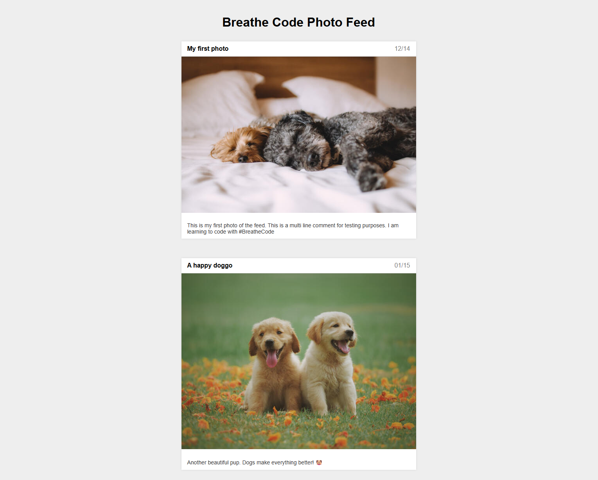

# feed-insta# postal-card

To download and deploy the app in your local enviroment just clone it and run VSCode go live extension and you will see it

Fundamentos
Reutilizar clases de CSS.
Reglas de CSS de Display y Position.
Construir un layout (diseño) con CSS/HTML.
Centrar contenedores.
Flow left y right.
Importar imágenes.
